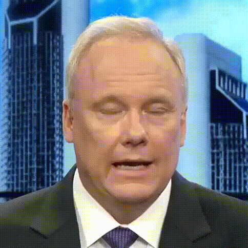
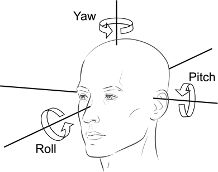
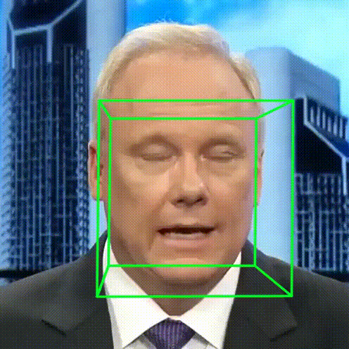

# Feature Extraction for Talking Face

Current support the following features:

* Scene Detection
* Face Cropping
* Landmark Extraction
* Face Angle Extraction
* Facial Action Unit (FAU) Extraction
* Audio Feature Extraction


## (Optional) Scene Detection

If the downloaded video is a full-frame image (face occupies a small portion), please first use [scene detection](https://github.com/Breakthrough/PySceneDetect) to split the videos to avoid vast scene change. 

You can refer to the following code:

```bash
python extract_scenes.py \
  --from_directory  '/path/to/before_scene_detected/' \
  --output_directory '/path/to/after_scene_detected/'
```

Subsequent filtering can be done based on some rough rules, such as removing files that are less than two seconds long, have an incorrect file format, or have empty file size.

```bash
python filter_videos_rough.py \
  --before_filtering_dir '/path/to/before_filtering/' \
  --after_filtering_dir '/path/to/after_filtering/' \
  --min_duration 2 \
  --min_size 10 
```


Upon completion of this step, you will have obtained the raw video data. An example of such data can be found at `data_processing/raw_data/FAzSK8PLmGI.mp4` or the [HDTF](https://github.com/MRzzm/HDTF) dataset.


## Facial Part Cropping

The purpose of this step is to crop the face from the frame. Note that our strategy differs from some methods as we do not align the face but rather fix the camera position. Please ensure that there is no significant movement of the person's face.

Note that the cropping strategy needs to be adjusted based on the actual scenario. For videos similar to the [HDTF](https://github.com/MRzzm/HDTF) dataset, the face occupies the majority of the frame. In contrast, for videos like those in the [EMO](https://humanaigc.github.io/emote-portrait-alive/), the face may only occupy a smaller portion of the frame. Data flow: from `data_processing/raw_data/` to `data_processing/cropped_faces/`

```bash

python extract_cropped_faces.py \
  --from_dir_prefix "data_processing/raw_data/" \
  --output_dir_prefix "data_processing/cropped_faces/" \
  --expanded_ratio 0.6

```



## Conversion to Specified Format

We strongly recommend using the ffmpeg command for this step, as our version is `5.0.1`. Using other modules such as opencv may result in dropped frames, which can cause the audio and video frames to not align accurately.


1. All videos file are converted to `25` frame-per-seconds (fps), from `data_processing/cropped_faces/` to `data_processing/specified_formats/videos/videos_25fps/`
2. The coresponding audio tracks are converted to the fixed sampling rate: `16k`, from `data_processing/raw_data` to `data_processing/specified_formats/audios/audios_16k/`
3. Video_frames will be extracted into `png` format, from `data_processing/specified_formats/videos/videos_25fps/` to `data_processing/specified_formats/videos/video_frames/`. The default frame filename will starts from `000001.png`.

Run:

```bash

python extract_raw_video_data.py \
  --source_folder 'data_processing/cropped_faces/' \
  --video_target_folder 'data_processing/specified_formats/videos/videos_25fps/' \
  --audio_target_folder 'data_processing/specified_formats/audios/audios_16k/' \
  --frames_target_folder 'data_processing/specified_formats/videos/video_frames/' \
  --convert_video True \
  --convert_audio True \
  --extract_frames True

```

## Face Landmark Detection
The purpose of this step is to obtain 68 2D facial landmarks, as illustrated in the figure below. For reference, please see the image provided.


Data flow: from `data_processing/specified_formats/videos/video_frames/` to `data_processing/specified_formats/videos/landmarks/`

Run:

```bash
python extract_frame_landmarks.py \
  --from_dir './data_processing/specified_formats/videos/video_frames/' \
  --lmd_output_dir './data_processing/specified_formats/videos/landmarks/' \
  --skip_existing

```

Landmarks are generated into a text file with the same name as the video. Each line represents the landmark coordinates for a specific frame, with a total of 68 landmarks. For the meaning of the specific coordinates, please refer to the figure above. The content of each file is like the following format:

```

000001.png 509_230 511_269 515_305 520_339 531_367 550_393 574_416 602_432 630_436 656_428 679_411 698_388 712_363 718_335 720_305 723_275 725_243 544_232 560_222 579_217 599_219 616_225 650_222 668_213 687_209 705_214 715_231 633_245 634_263 635_279 637_297 614_316 623_319 633_322 643_319 651_315 568_251 581_251 593_249 604_250 593_253 581_253 656_250 669_246 682_247 693_251 682_253 669_252 588_356 606_347 622_343 632_345 643_342 656_346 670_354 656_369 643_376 632_378 621_378 605_372 595_356 621_352 632_353 643_351 663_354 642_361 632_363 621_363

...

```

## Face Orientation Angles

Facial orientation includes 3D poses: pitch, yaw, and roll.



Follow the instructions [3DDFA_V2](https://github.com/cleardusk/3DDFA_V2) and build the environment. Copy the path link to `.3ddfav2_path` and run the following codes to get pose angles.

```bash

python extract_face_orientation.py \
    --video_frames_dir 'data_processing/specified_formats/videos/video_frames/' \
    --visualization_dir 'data_processing/specified_formats/videos/pose_orientations/visualization/' \
    --pose_data_dir 'data_processing/specified_formats/videos/pose_orientations/pose_data/'

```




Other Tools (we have not tested) can also be used to extract facial orientation: [OpenFace](https://github.com/TadasBaltrusaitis/OpenFace), [GAIA](https://gaiavatar.github.io/gaia/) mentioned that they uses [3DDFA](https://github.com/cleardusk/3DDFA), [EMO](https://humanaigc.github.io/emote-portrait-alive/) utlizes [mediapipe](https://github.com/google/mediapipe/) and get pose speed. [DAE-talker](https://arxiv.org/abs/2303.17550) utlizes [this tool](https://pypi.org/project/headpose/).

## (Optional) Facial Action Unit (FAU) Extraction 

You can skip this stage if you do not need it. [AU definition docs](https://www.cs.cmu.edu/~face/facs.htm)

This part is based on [OpenFace](https://github.com/TadasBaltrusaitis/OpenFace). We recommend runing the code in [docker](https://github.com/TadasBaltrusaitis/OpenFace/wiki/Docker) and follow the command from [Openface wiki](https://github.com/TadasBaltrusaitis/OpenFace/wiki/Command-line-arguments). 


After having lanuched the docker instance, run:

```
python extract_action_units.py \
  --from_dir_path 'data_processing/specified_formats/videos/video_frames/' \
  --to_dir_path 'data_processing/specified_formats/videos/facial_action_units/'
```

## Audio Feature Extraction

Before extraction, please make sure that all audio files have a sampling rate of `16k` Hz. and download the weights from [URL](https://github.com/TencentGameMate/chinese_speech_pretrain) and put them into weights dir. Although this model was pre-trained on 10,000 hours of Chinese data as unsupervised training data, we have also found that it can generalize to other languages as well.


```bash 

python extract_audio_features.py \
  --model_path "weights/chinese-hubert-large" \
  --audio_dir_path "./data_processing/specified_formats/audios/audios_16k/" \
  --audio_feature_saved_path "./data_processing/specified_formats/audios/hubert_features/" \
  --computed_device "cuda" \
  --padding_to_align_audio True

```

* The purpose of padding_to_align_audio is to pad the end of the audio to match the dimensionality, with the goal of maintaining consistency with video frames for convenient training.
* The result shape is `(25, T, 1024)`, 25 means all hidden layers including the one audio feature extraction plus 24 hidden layers. You can change code get specific layers, such as last layer, for training.
* The purpose for extract all layers is that we trained on `weighted sum` strategies in [this project](https://github.com/liutaocode/DiffDub).
* Currently, we only have tested feature extraction on hubert model.
* If you want to extract MFCC feature, you can use `python_speech_features`.


## TODO lists

- [ ] Add detailed Environment Config
- [ ] Visualized Jupyter Code


## Acknowledgements

* https://github.com/MRzzm/HDTF
* https://github.com/TencentGameMate/chinese_speech_pretrain
* https://github.com/DefTruth/torchlm
* https://github.com/TadasBaltrusaitis/OpenFace
* https://github.com/cleardusk/3DDFA_V2